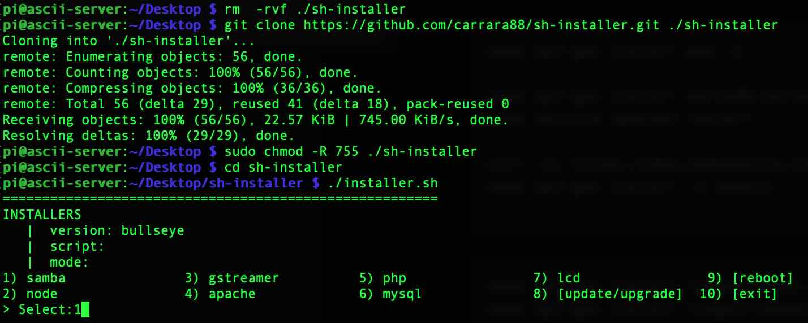

# SH-Installer | an easy bash script installer 

Created for an easy raspberry-pi setup, it can be used on any debian/unix system, enjoy!

__Version:__ 0.1 (unstable|incomplete) \
__OS:__ Debian/Unix \
__Require:__ curl, npm, git



## Setup
---
Git clone repo, fix permissions and you are ready!\
Open terminal, navigate to your favourite script folder and run:
```
$ rm  -rf ./sh-installer
$ git clone https://github.com/carrara88/sh-installer.git ./sh-installer
$ sudo chmod -R 755 ./sh-installer
$ cd sh-installer
$ ./installer.sh
```

## Installer Config
---
Edit configurations on top of `installer.sh` file:

```
    # CONFIGURATIONS
    INSTALLER_LOOP=true
    OS_VERSION="bullseye" # OS version
    INSTALLER_DIR="/home/pi/Desktop/sh-installer/installers" # base installer scripts dir
    # SETUPS
    DESTINATION="/var/www/server" # installers destination dir
    INSTALLED="${DESTINATION}/installed" # installers status dir
```

## Installer Usage
---
There are 2 ways to run installer, __[Selector]__ and __[Commands]__.

Use __[Selector]__ to perform GUI installer loop, use __[Commands]__ to bypass GUI loop and run single installer script.

### Installer - Selector
---
Main installer execute a GUI script selector. To perform single or multiple installer scripts open console and run:

```
./installer.sh
```

### Installer - Commands
---
To perform single installer script, open console and run:

```
./installer.sh -s=[script] -m=[mode]
```

#### Command -s | --script
---
Used to select a single script:
```
-s = script-name
example: ./installer.sh --script=php
example: ./installer.sh -s=php
```
##### available -s commands:
 - `$ ./installer.sh -s="php"`
 - `$ ./installer.sh -s="apache"`
 - `$ ./installer.sh -s="mysql"`
 - `$ ./installer.sh -s="samba"`
 - `$ ./installer.sh -s="node"`
 - `$ ./installer.sh -s="gstreamer"`
 - `$ ./installer.sh -s="lcd"`

#### Command -m | --mode
---
Used to overwrite any previous run:
```
-m = mode
example: ./installer.sh --mode=1
example: ./installer.sh -m=1
```
##### available -m commands:
 - `$ ./installer.sh -m=1`
 - `$ ./installer.sh -s=0`


## Installers (executable bash scripts)
---
Installers (executable bash scripts), are located into `./installers` sub-directory, following the naming pattern `[script-name].installer.sh`.

#### Available installers:

 - [x] php
 - [x] apache
 - [x] nginx
 - [x] certbot
 - [x] mysql
 - [x] samba
 - [x] node
 - [x] gstreamer
 - [x] lcd (LCD Drivers only for raspberry-pi)

#### Coming-soon installers:
 - [ ] fail2ban
 - [ ] modSecurty
 - [ ] watchdog
 - [ ] composer
 - [ ] docker
 - [ ] couchdb

##### Installers [Commands] examples:
```
$ ./installer.sh "php"
$ ./installer.sh "samba"
$ ./installer.sh "samba" 1
```